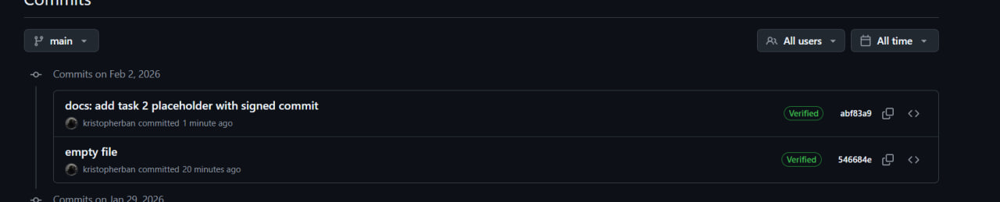

ssh подписи это хорошо) и полезно. мы их используем чтобы пушить без пароля от гита и сразу верифицироваться, то есть это полнзно если ты хочешь, чтобы не подумали что коммит сделал не ты. в общем, работа в команде становится безопасней.
ss
